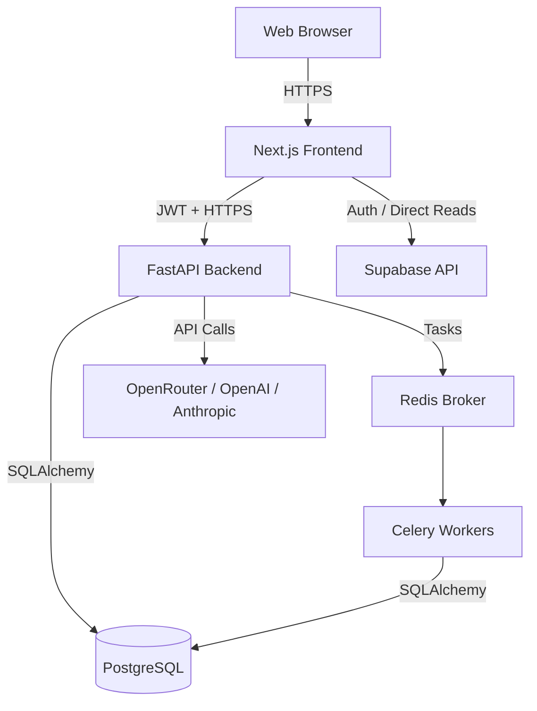
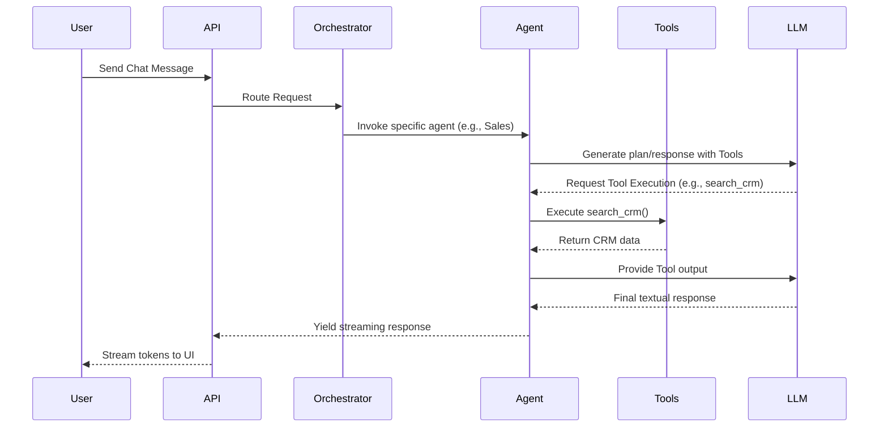

# System Architecture

## 1. System Overview

AI Employee OS utilizes a modern, decoupled architecture.
- **Frontend:** Next.js (App Router) serving the presentation layer.
- **Backend:** FastAPI acting as the business logic, API, and AI orchestration layer.
- **Database:** Supabase (PostgreSQL) handling persistence, authentication, and security via RLS.
- **Workers:** Celery handling background asynchronous tasks (e.g., embeddings, email ingestion).

## 2. Layered Architecture

## 3. Request Lifecycle

1. **Authentication:** The user logs in via the Next.js frontend, which directly calls Supabase Auth. Supabase returns a JWT.
2. **API Request:** The frontend makes a REST API request to the FastAPI backend, placing the Supabase JWT in the `Authorization: Bearer` header.
3. **Middleware Interception:** The FastAPI middleware intercepts the request. The `get_current_user` dependency decodes the JWT using the `SUPABASE_JWT_SECRET` and extracts the `user_id` and `organization_id`.
4. **Business Logic:** The backend executes the requested logic (e.g., retrieving leads) using SQLAlchemy.
5. **Database Interaction:** SQLAlchemy queries the Postgres database using a service-role/superuser connection.
6. **Response:** The backend formats the data using Pydantic schemas and returns JSON to the frontend.

## 4. Database Architecture

- **Multi-Tenancy:** Achieved exclusively through Row Level Security (RLS). Every table (except platform-level tables) contains an `organization_id` column.
- **RLS Policies:** Policies force `organization_id = current_org_id()`. The `current_org_id()` is a Postgres SECURITY DEFINER function that reads the organization of the currently authenticated user (via `auth.uid()`).
- **Vector Storage:** The `knowledge_articles` and `ai_memories` tables utilize the `pgvector` extension to store text embeddings for Retrieval-Augmented Generation (RAG).

## 5. AI Architecture

## 6. Deployment Architecture (Target)

- **Frontend Hosting:** Vercel (Optimized for Next.js).
- **Backend Hosting:** Render, Railway, or AWS ECS running Docker containers (Web API and Celery Worker).
- **Database:** Supabase Cloud (Managed PostgreSQL).
- **Cache/Broker:** Redis (Upstash or Redis Labs).
