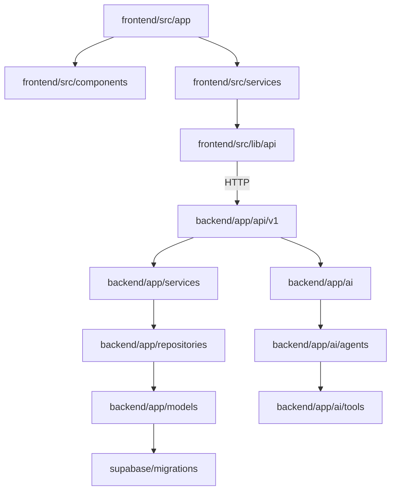
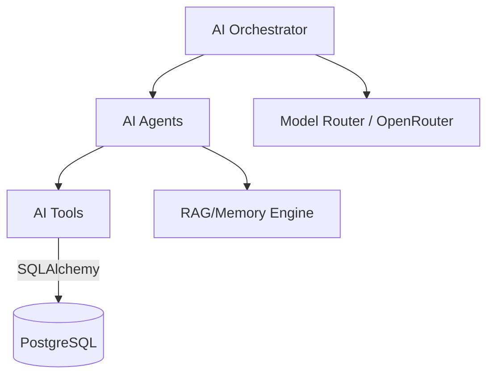
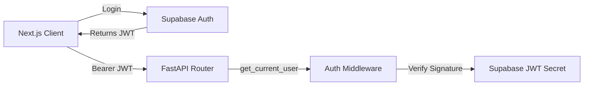

# DEPENDENCY_GRAPH.md

## High-Level Folder Dependencies

```mermaid
graph TD
    frontend/src/app --> frontend/src/components
    frontend/src/app --> frontend/src/services
    frontend/src/services --> frontend/src/lib/api
    
    frontend/src/lib/api -->|HTTP| backend/app/api/v1
    
    backend/app/api/v1 --> backend/app/services
    backend/app/services --> backend/app/repositories
    backend/app/repositories --> backend/app/models
    
    backend/app/api/v1 --> backend/app/ai
    backend/app/ai --> backend/app/ai/agents
    backend/app/ai/agents --> backend/app/ai/tools
    
    backend/app/models --> supabase/migrations
```

## AI Component Dependencies

```mermaid
graph TD
    Orchestrator[AI Orchestrator]
    Agents[AI Agents]
    Tools[AI Tools]
    RAG[RAG/Memory Engine]
    ModelRouter[Model Router / OpenRouter]
    
    Orchestrator --> Agents
    Orchestrator --> ModelRouter
    Agents --> Tools
    Agents --> RAG
    Tools --> |SQLAlchemy| DB[(PostgreSQL)]
```

## Authentication Dependency Flow

```mermaid
graph LR
    NextJS_Client[Next.js Client] -->|Login| SupabaseAuth[Supabase Auth]
    SupabaseAuth -->|Returns JWT| NextJS_Client
    NextJS_Client -->|Bearer JWT| FastAPI_Router[FastAPI Router]
    FastAPI_Router -->|get_current_user| FastAPI_Middleware[Auth Middleware]
    FastAPI_Middleware -->|Verify Signature| SupabaseJWT[Supabase JWT Secret]
```
